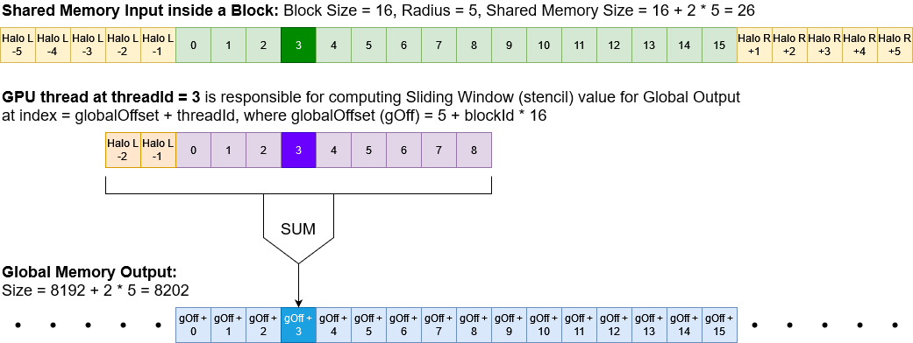

# Homework 2

This lesson deals with shared memory on the device.  Device threads in the same block can share memory that is allocated on the device.

## **A1. Matrix Multiplication using Shared Memory**

Will this shared memory version be faster than global version?  In fact no.  Probably because it takes time to allocate the shared memory and then copy the necessary portion of global data into it.  But perhaps with more threads and a larger block size some speed ups would be seen.

## **A2. Matrix Multiplication using Global Memory**

Still the fastest.

## **B. Stencil (sliding window) Operation**

Stencil operations are well-suited to using shared memory, because threads must access a window of data that spans the data locations aligned with other threads in the block.

